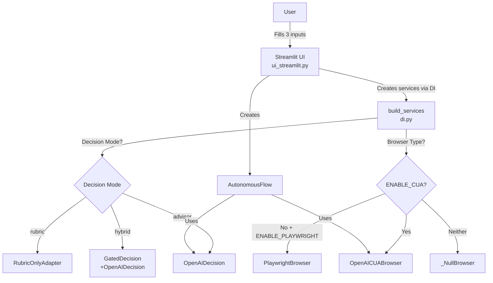
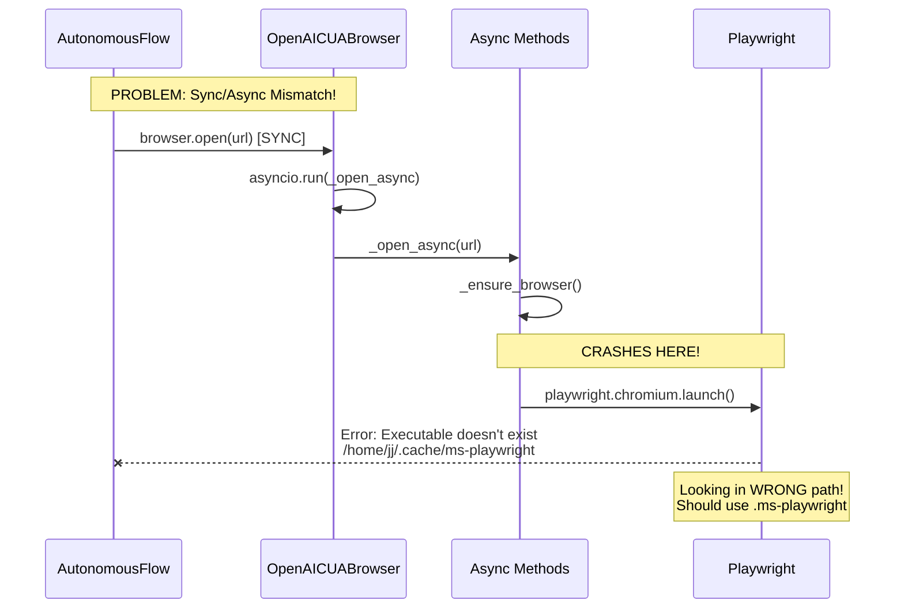
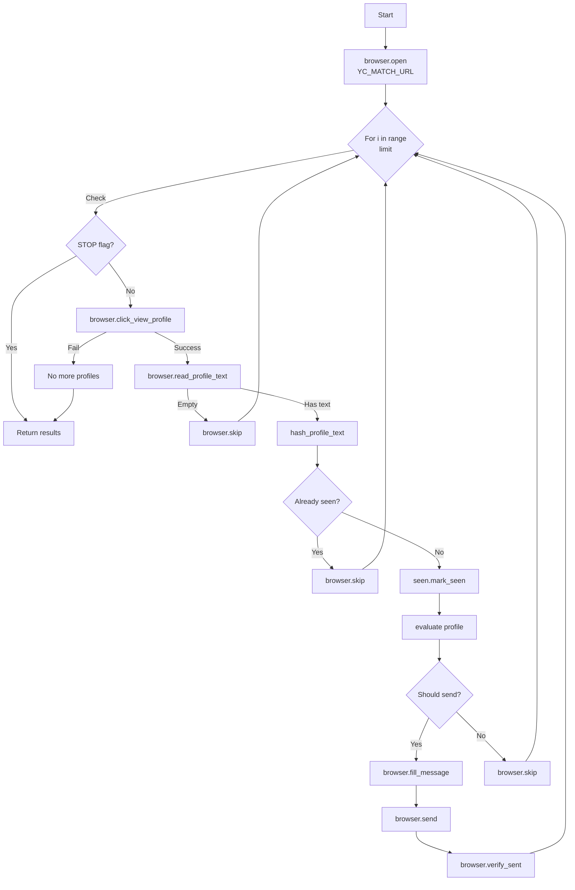
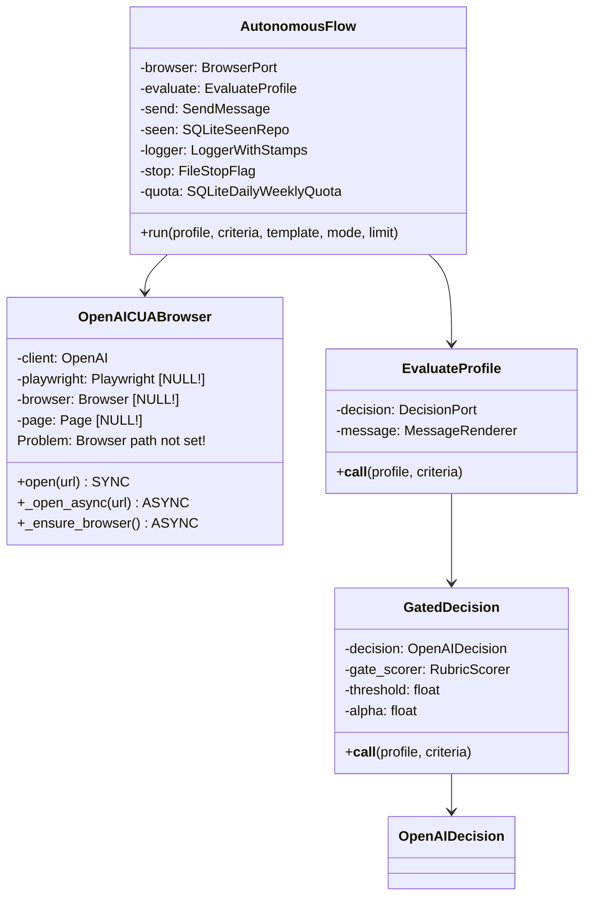

# YC Co-Founder Matcher - Architecture Diagrams

## The ACTUAL Data Flow (From Code Analysis)

### 1. Entry Point Flow



### 2. The REAL Browser Problem



### 3. What's Actually Happening in AutonomousFlow



### 4. The Actual Class Dependencies



### 5. Why It's Failing - The Real Issue

```mermaid
graph TB
    subgraph "Current State"
        ENV[PLAYWRIGHT_BROWSERS_PATH=.ms-playwright<br/>Set in environment]
        CUA[OpenAICUABrowser]
        PW[Playwright]
    end
    
    subgraph "The Problem"
        INIT[_ensure_browser called]
        LAUNCH[playwright.chromium.launch<br/>headless=False]
        FAIL[Looks for browser in<br/>/home/jj/.cache/ms-playwright]
    end
    
    subgraph "Why?"
        R1[Environment variable not passed<br/>to async context]
        R2[Playwright ignores env var<br/>after initialization]
        R3[Need to set BEFORE<br/>async_playwright().start()]
    end
    
    ENV -.NOT USED.-> CUA
    CUA --> INIT
    INIT --> LAUNCH
    LAUNCH --> FAIL
    
    FAIL --> R1
    FAIL --> R2
    FAIL --> R3
```

### 6. The Fix We Need

```mermaid
graph LR
    subgraph "Before _ensure_browser"
        SET[os.environ['PLAYWRIGHT_BROWSERS_PATH']<br/>= '.ms-playwright']
    end
    
    subgraph "Then"
        START[async_playwright().start()]
        LAUNCH[chromium.launch()]
    end
    
    SET --> START
    START --> LAUNCH
    LAUNCH --> SUCCESS[Browser opens!]
```

## The Truth

1. **It IS simple** in concept - browse, evaluate, send
2. **BUT** the implementation has issues:
   - Async/sync mismatch between layers
   - Browser path not being set correctly
   - Environment variables not propagating to async context

3. **The core loop works** but can't start because browser won't launch

4. **We lost our fixes** when we reset to avoid the API key issue