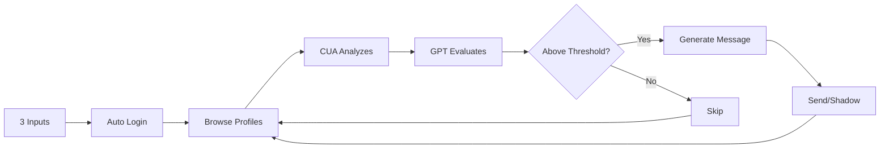

# YC Co-Founder Matcher Bot 🤖

Autonomous browser automation for YC Startup School co-founder matching using OpenAI's Computer Use API (CUA) and GPT-5/GPT-4 models.

## 🎯 What It Does

This bot automates the tedious process of browsing YC Co-Founder Matching profiles. It evaluates candidates against your criteria and sends personalized messages to promising matches - all autonomously.

## ✨ Key Features

### 🤖 Dual AI System
- **OpenAI Computer Use API**: Analyzes screenshots and plans browser actions
- **GPT-5/GPT-4 Decision Engine**: Evaluates profiles and generates personalized messages
- **Playwright Executor**: Performs actual browser automation based on CUA instructions

### 🎮 Three Decision Modes
1. **Advisor Mode**: AI suggests, you approve each message
2. **Rubric Mode**: Rule-based scoring with auto-send above threshold
3. **Hybrid Mode**: Combines AI confidence with rubric scores

### 🛡️ Safety Features
- **Shadow Mode**: Test without actually sending messages
- **STOP Flag**: Instant abort with `.runs/stop.flag`
- **Quotas**: Daily/weekly sending limits
- **Deduplication**: Never message the same person twice
- **Rate Limiting**: Configurable delays between actions

### 🏗️ Clean Architecture
- Domain-Driven Design with Hexagonal Architecture
- SOLID principles throughout
- Full type safety with mypy strict mode
- 80%+ test coverage
- Dependency injection for testability

## 🚀 Quick Start

```bash
# 1. Clone repository
git clone https://github.com/Clarity-Digital-Twin/yc-cofounder-bot.git
cd yc-cofounder-bot

# 2. Install dependencies and browsers
make setup
make browsers

# 3. Configure environment
cp .env.example .env
# Edit .env and add:
# - OPENAI_API_KEY=sk-...
# - YC_EMAIL=your-email@example.com
# - YC_PASSWORD=your-password

# 4. Launch the web UI
make run
```

Open http://localhost:8502 and provide:
1. **Your Profile** - Who you are and what you bring
2. **Match Criteria** - What you're looking for
3. **Message Template** - Your outreach template (will be personalized by AI)

Click **"Start Autonomous Browsing"** and watch it work!

## 🔧 Configuration

### Required Environment Variables
```bash
# OpenAI Configuration
OPENAI_API_KEY=sk-...              # Your OpenAI API key

# YC Credentials (for auto-login)
YC_EMAIL=your-email@example.com
YC_PASSWORD=your-password

# Decision Mode Configuration
DECISION_MODE=hybrid               # advisor|rubric|hybrid
THRESHOLD=0.72                     # Auto-send threshold
ALPHA=0.50                        # Hybrid weight (0=rubric, 1=AI)

# Safety Settings
SHADOW_MODE=1                      # 1=test mode (no actual sends)
PACE_MIN_SECONDS=45               # Minimum delay between sends
DAILY_QUOTA=25                    # Max sends per day
WEEKLY_QUOTA=120                  # Max sends per week
```

### Model Resolution (NEW!)
The bot now **automatically discovers** the best available models via OpenAI's API:
- Prefers GPT-5 variants (if available on your account)
- Falls back to GPT-4 models automatically
- No need to hardcode model names!

## 📊 How It Works



1. **Input Phase**: You provide profile, criteria, and template
2. **Login Phase**: Auto-login to YC with stored credentials
3. **Browse Phase**: Navigate to co-founder profiles
4. **Analysis Phase**: CUA + Playwright work together to read profiles
5. **Decision Phase**: GPT-5/GPT-4 evaluates match quality
6. **Message Phase**: AI personalizes your template
7. **Send Phase**: Sends message (or logs in shadow mode)

## 🧪 Development

```bash
# Run tests
make test          # Unit tests
make test-int      # Integration tests  
make verify        # Full verification (lint + type + tests)

# Code quality
make lint          # Run linter
make format        # Auto-format code
make type          # Type checking

# Utilities
make clean         # Clean build artifacts
make check-cua     # Verify OpenAI CUA access
```

## 📁 Project Structure

```
yc-cofounder-bot/
├── src/yc_matcher/
│   ├── domain/           # Pure business logic (DDD)
│   ├── application/      # Use cases & orchestration
│   ├── infrastructure/   # External adapters (OpenAI, Playwright)
│   └── interface/        # UI & dependency injection
├── tests/
│   ├── unit/            # Fast, isolated tests
│   ├── integration/     # Component integration tests
│   └── e2e/            # Full flow tests
├── docs/               # Comprehensive documentation
├── scripts/            # Utility scripts
└── .runs/             # Runtime data (quotas, logs)
```

## 🎯 Key Improvements (August 2025)

- ✅ **Single Browser Instance**: Fixed singleton pattern - no more multiple windows!
- ✅ **Auto-Login**: Automatic YC login with stored credentials
- ✅ **Model Discovery**: Automatic model selection via OpenAI API
- ✅ **Message Personalization**: Templates are personalized by AI, not just pasted
- ✅ **Profile Detection**: Correctly identifies when on profile pages
- ✅ **Proper CUA Integration**: Uses Responses API with proper chaining

## 🚨 Important Notes

### OpenAI Account Requirements
- **GPT-4 minimum** (GPT-5 preferred if available)
- **Computer Use API access** (Tier 3-5 accounts)
- Check available models: `make check-cua`

### Safety First
- Always start with `SHADOW_MODE=1` to test without sending
- Use conservative quotas initially
- Monitor `.runs/events.jsonl` for all actions
- Create `.runs/stop.flag` to abort immediately

### Known Limitations
- Requires Chromium browser (installed via `make browsers`)
- YC may rate-limit or require captcha after many actions
- Computer Use API is in preview and may have inconsistencies

## 📚 Documentation

- [`CLAUDE.md`](CLAUDE.md) - Development guidelines and architecture
- [`docs/`](docs/) - Complete documentation set
- [`AUDIT_AND_PLAN.md`](AUDIT_AND_PLAN.md) - Current implementation status
- [`MODEL_RESOLUTION_IMPLEMENTED.md`](MODEL_RESOLUTION_IMPLEMENTED.md) - Model discovery details

## 🤝 Contributing

This project follows strict Clean Code principles:
- TDD (Test-Driven Development) required
- SOLID principles enforced
- Full type annotations
- Must pass `make verify` before commits

## 📄 License

MIT License - See LICENSE file for details

## 🙏 Acknowledgments

- OpenAI for Computer Use API and GPT models
- Playwright team for excellent browser automation
- YC Startup School for the platform

---

**Built with excellence, no yak shaving** 🚀

*For Hacker News readers: This is a real working implementation of OpenAI's Computer Use API combined with GPT-5/GPT-4 for autonomous web automation. Check out the [architecture docs](docs/) to see how CUA and Playwright work together as planner and executor.*