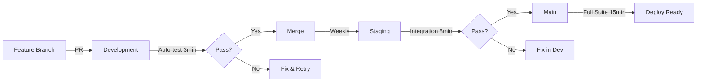

# CI/CD Differential Strategy

## Branch Protection Strategy

Simple, incremental validation across three branches:

### 1. Development Branch (Fast Feedback)
**Purpose**: Rapid iteration, catch obvious issues early
**Checks**:
- ✅ Lint (ruff) - 30 seconds
- ✅ Type check (mypy) - 1 minute  
- ✅ Unit tests only - 2 minutes
- **Total**: ~3 minutes

**When to merge**: Daily active development

### 2. Staging Branch (Integration Validation)
**Purpose**: Ensure components work together
**Checks**:
- ✅ All development checks
- ✅ Integration tests (with headless Playwright) - 5 minutes
- ✅ Browser singleton tests
- ✅ Async safety tests
- **Total**: ~8 minutes

**When to merge**: Feature complete, ready for final testing

### 3. Main Branch (Production Ready)
**Purpose**: Deployable, fully validated code
**Checks**:
- ✅ Full `make verify` suite
- ✅ All unit + integration tests
- ✅ Coverage report (70% minimum)
- ✅ Security scan (safety check)
- ✅ Secrets scan (no API keys)
- **Total**: ~15 minutes

**When to merge**: Release candidates only

## Key Differentiators

### Speed vs Thoroughness Trade-off
```
development: 3 min  → Fast feedback, basics only
staging:     8 min  → Add integration, browser tests  
main:       15 min  → Full validation + security
```

### Test Scope Progression
```
development: tests/unit/              (113 tests)
staging:     tests/unit/ + tests/integration/ (125 tests)
main:        tests/ (all)             (130+ tests)
```

### Environment Variables
```yaml
# All branches
PACE_MIN_SECONDS: 0  # Disable delays in CI

# Staging + Main only
PLAYWRIGHT_HEADLESS: 1  # Required for browser tests

# Main only
COVERAGE: 1  # Generate coverage reports
```

## Branch Rules (GitHub Settings)

### Development
- Require PR reviews: No
- Required checks: lint, type-check
- Allow force push: Yes (for rebasing)
- Auto-delete head branches: Yes

### Staging  
- Require PR reviews: Optional
- Required checks: lint, type-check, integration-tests
- Allow force push: No
- Restrict push: Team members only

### Main
- Require PR reviews: Yes (1 approval)
- Required checks: ALL must pass
- Allow force push: Never
- Restrict push: Admin only
- Require up-to-date: Yes

## Failure Handling

### Development failures
- **Action**: Fix immediately or revert
- **Impact**: Blocks personal work only

### Staging failures
- **Action**: Must fix before next release
- **Impact**: Blocks team integration

### Main failures
- **Action**: Hotfix or rollback immediately
- **Impact**: Blocks all deployments

## Cost Optimization

1. **Conditional execution**: Jobs only run for relevant branches
2. **Fail fast**: Type/lint fail early before expensive tests
3. **Parallel jobs**: Lint and type-check run simultaneously
4. **Timeout limits**: 
   - Unit tests: 5 minutes max
   - Integration: 10 minutes max
   - Full suite: 15 minutes max

## Local Equivalents

Developers can run same checks locally:
```bash
# Development equivalent
make lint type test

# Staging equivalent  
make verify

# Main equivalent
make verify && make coverage
```

## Migration Path

1. **Phase 1** (Now): Add `.github/workflows/ci.yml`
2. **Phase 2**: Configure branch protection rules in GitHub
3. **Phase 3**: Add badge to README showing CI status
4. **Phase 4**: Add deployment automation (optional)

## Example PR Flow



## Monitoring

Track these metrics monthly:
- Average CI time per branch
- Failure rate by test type
- Most common failure causes
- Time from commit to main

Simple, effective, scales with team size.