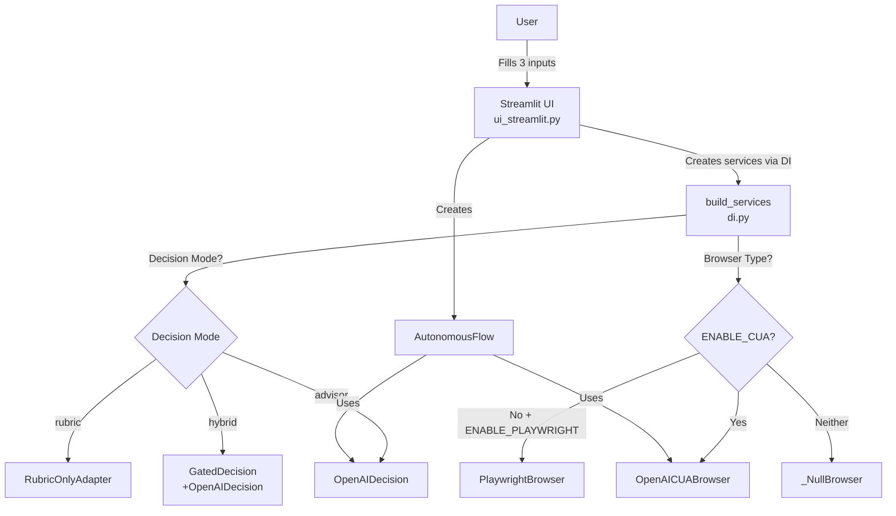
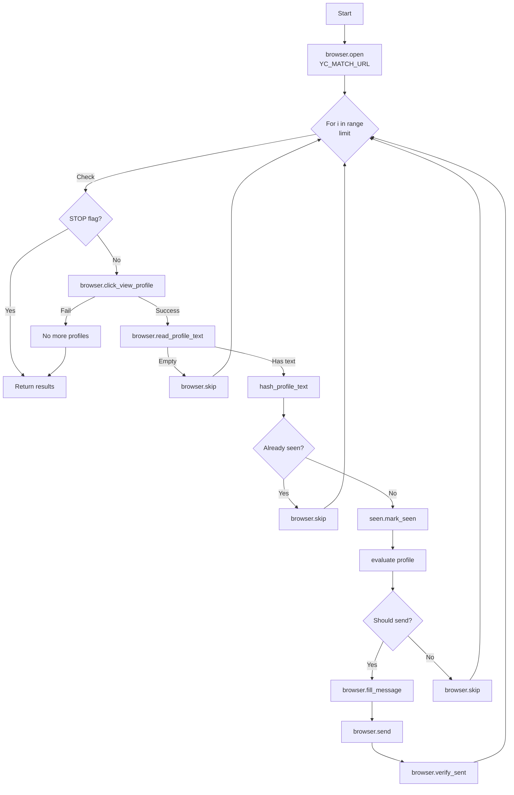
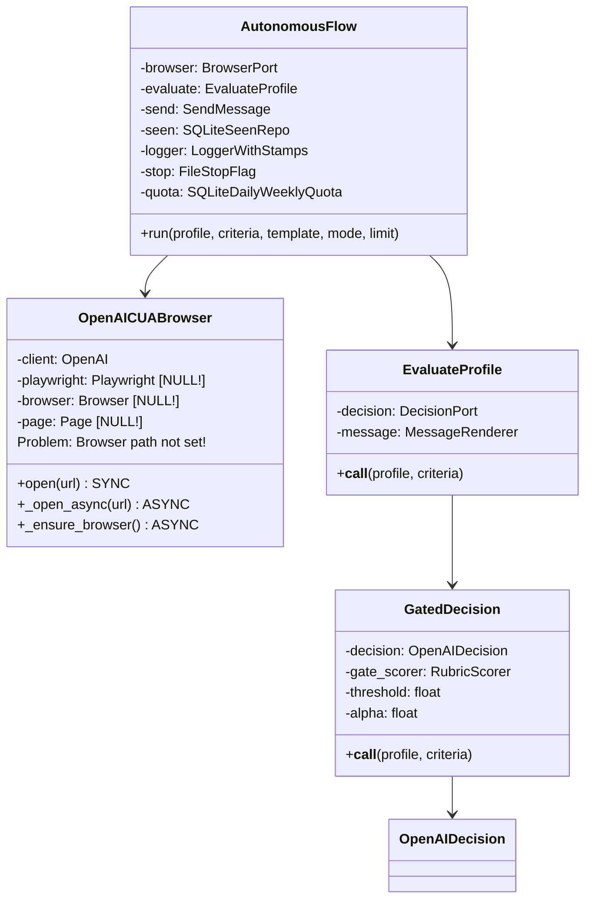
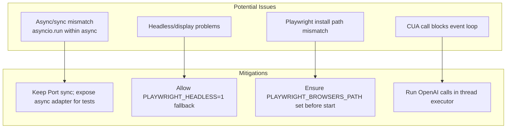
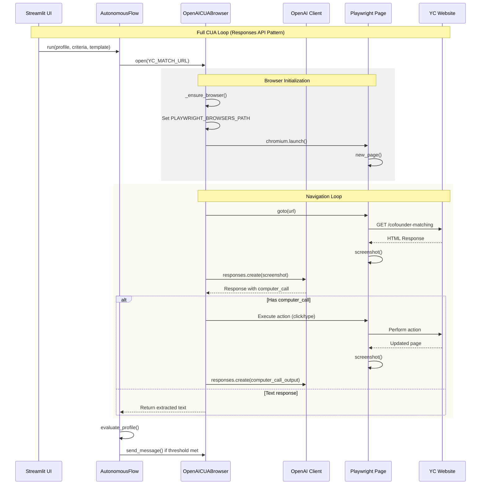
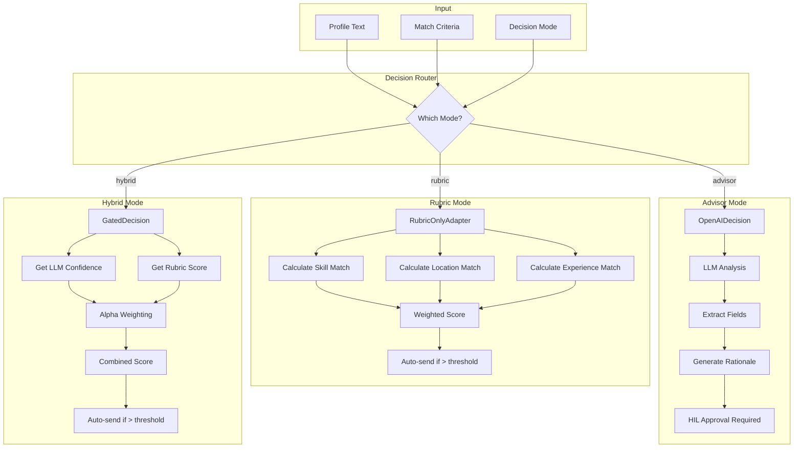
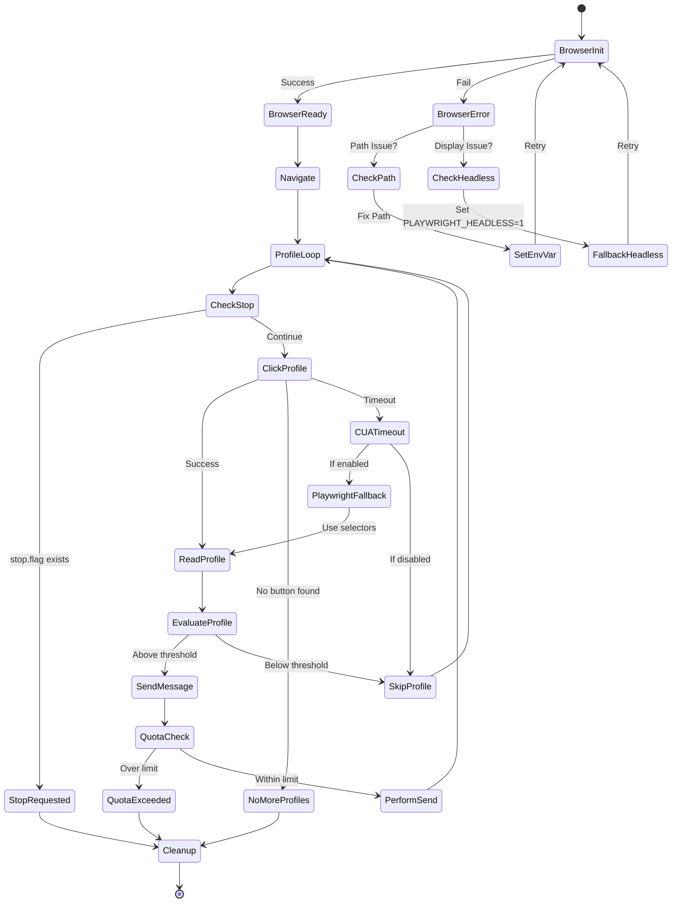
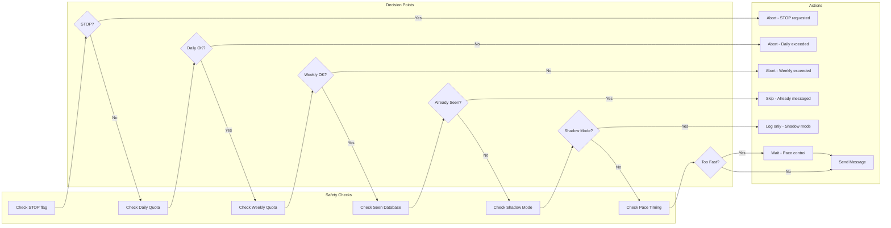
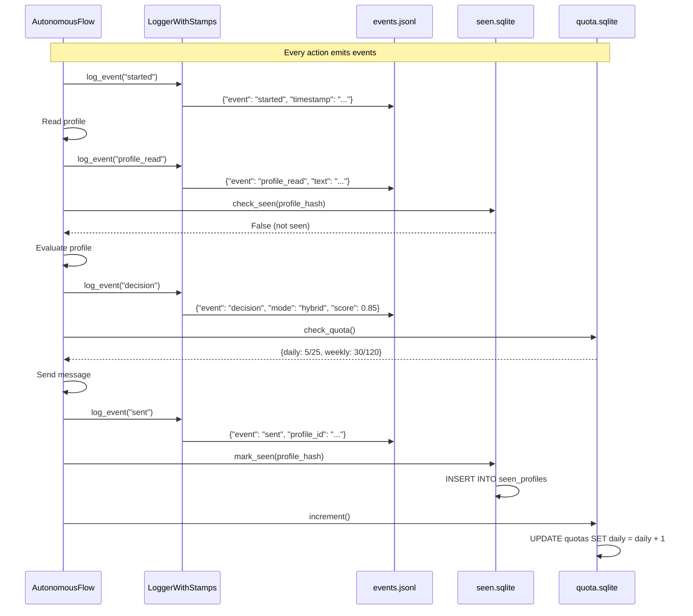

# YC Co-Founder Matcher - Architecture Diagrams

## The ACTUAL Data Flow (From Code Analysis)

### 1. Entry Point Flow



### 2. Browser Init & Async/Sync Edges

```mermaid
sequenceDiagram
    participant AF as AutonomousFlow
    participant CUA as OpenAICUABrowser
    participant ASYNC as Async Methods
    participant PW as Playwright
    
    Note over AF,CUA: Sync/async boundary is sensitive
    
    AF->>CUA: open(url) [sync]
    CUA->>CUA: asyncio.run(_open_async)
    CUA->>ASYNC: _open_async(url)
    ASYNC->>ASYNC: _ensure_browser()
    ASYNC->>PW: async_playwright().start(); chromium.launch()
    Note over CUA,PW: PLAYWRIGHT_BROWSERS_PATH set before start (current code)
    
    alt Called from an active loop
        CUA--xAF: asyncio.run raises "loop already running"
    else Normal sync context
        PW-->>CUA: Page ready
    end
```

### 3. What's Actually Happening in AutonomousFlow



### 4. The Actual Class Dependencies



### 5. Common Failure Modes



### 6. The Fix We Need

```mermaid
graph LR
    subgraph "Before _ensure_browser"
        SET[os.environ['PLAYWRIGHT_BROWSERS_PATH']<br/>= '.ms-playwright']
    end
    
    subgraph "Then"
        START[async_playwright().start()]
        LAUNCH[chromium.launch()]
    end
    
    SET --> START
    START --> LAUNCH
    LAUNCH --> SUCCESS[Browser opens!]
```

## The Truth

1. **It IS simple** in concept - browse, evaluate, send
2. **BUT** the implementation has issues:
   - Async/sync mismatch between layers
   - Browser path not being set correctly
   - Environment variables not propagating to async context

3. **The core loop works** but can't start because browser won't launch

4. **We lost our fixes** when we reset to avoid the API key issue

## 7. CUA + Playwright Detailed Interaction Flow



## 8. Decision Flow Architecture (All 3 Modes)



## 9. Error Handling & Recovery Flows



## 10. Quota & Safety Mechanisms Flow



## 11. Event Logging & Persistence Flow



## 12. BUGS & ISSUES IDENTIFIED (Validated Against Code)

### Critical Bugs Found:

1. **Async/Sync Interface Mismatch**
   - Ports are synchronous; several tests expect async methods
   - Risk: `asyncio.run()` fails when invoked inside an existing event loop
   - Action: Keep sync `BrowserPort` for app; provide an async test adapter or add `awaitable` wrappers guarded by "if loop running"

2. **Playwright Headless/Install Variance**
   - Launch can fail on CI/headless displays or missing install path
   - Current code sets `PLAYWRIGHT_BROWSERS_PATH` before start (good)
   - Action: Document `python -m playwright install chromium`; allow `PLAYWRIGHT_HEADLESS=1` fallback in docs/UI

3. **CUA Calls Block Event Loop**
   - `responses.create(...)` is sync but used inside `async` code
   - Risk: blocks the loop under real I/O; tests mock this
   - Action: run blocking calls in a thread via `asyncio.to_thread` or `loop.run_in_executor`

4. **Limited Error Recovery in Flow**
   - Flow catches exceptions and skips, but no retries/backoff
   - Action: Add small bounded retries for read/skip, and restart browser on fatal errors

5. **Quota Atomicity (File Counter)**
   - `FileQuota` JSON counter is not atomic across processes
   - Action: Prefer SQLite quota (already implemented) or add file lock

6. **Profile Text Cache Semantics**
   - Cache retains last text to avoid empty return; not a leak but can mislead
   - Action: Clear cache on navigation/skip to avoid stale reuse

7. **HIL Callback Robustness**
   - Code assumes async callback; a sync callback would error
   - Action: accept both sync/async callbacks (inspect and wrap accordingly)

8. **STOP Check Granularity**
   - Checked at loop head; SendMessage path doesn’t re-check
   - Action: Re-check stop before send, and in long operations

9. **Pacing Blocks UI Thread**
   - `time.sleep` in `SendMessage` blocks for `PACE_MIN_SECONDS`
   - Action: Move pacing outside or make non-blocking when called from UI
