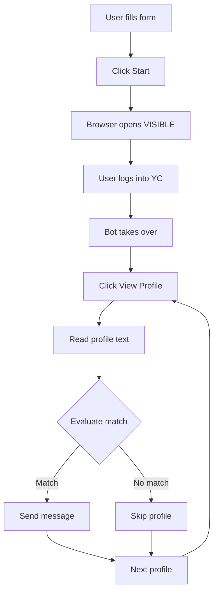

# How YC Co-Founder Matcher Works

## 🎯 Overview

This bot automates browsing YC Startup School co-founder profiles using:
- **Playwright** for browser automation (opening pages, clicking buttons)
- **OpenAI CUA** (optional) for AI-powered browser control
- **Streamlit** for the user interface

## 🚀 The Complete User Flow

### Step 1: Launch the App
```bash
make run  # Opens Streamlit on http://localhost:8502
```

### Step 2: Fill in Your Information
In the Streamlit UI, provide:
1. **Your Profile** - Description of yourself
2. **Match Criteria** - What you're looking for
3. **Message Template** - How to reach out (must include `{name}`)

### Step 3: Start Automation
Click "🚀 Start Autonomous Browsing"

### Step 4: Browser Opens (THE KEY PART!)
**IMPORTANT**: When you click Start:
1. A **VISIBLE browser window** opens (not headless!)
2. The browser navigates to YC co-founder matching page
3. **YOU must manually log in** to YC with your credentials
4. Navigate to the co-founder matching dashboard

### Step 5: Continue Automation
Once logged in and on the matching page:
1. The bot takes over
2. It clicks "View profile" on each candidate
3. Reads the profile text
4. Evaluates based on your criteria
5. Either sends a message or skips (based on threshold)

## 🔧 Technical Flow



## 🐛 Current Issues & Solutions

### Issue: Browser Not Opening
**Symptom**: Click Start but no browser window appears

**Cause**: `PLAYWRIGHT_HEADLESS=1` makes browser invisible

**Solution**: 
```bash
# Set in .env or when running:
PLAYWRIGHT_HEADLESS=0  # Makes browser visible
PLAYWRIGHT_BROWSERS_PATH=.ms-playwright  # Use local browsers
```

### Issue: "Executable doesn't exist"
**Symptom**: Error about missing browser executable

**Solution**:
```bash
# Install browsers locally:
PLAYWRIGHT_BROWSERS_PATH=.ms-playwright uv run python -m playwright install chromium
```

### Issue: Can't Access Profiles
**Symptom**: Bot can't find any profiles to click

**Cause**: Not logged into YC

**Solution**: The browser MUST be visible so user can log in manually first

## 🎭 Browser Modes

### Playwright-Only Mode (Current)
- Direct browser automation
- User must log in manually
- More reliable but less "intelligent"

### CUA Mode (When enabled)
- OpenAI's Computer Use API analyzes screenshots
- Makes intelligent decisions about what to click
- Still requires manual login
- Set: `ENABLE_CUA=1` and `CUA_MODEL=<your-model>`

## 🔒 Safety Features

1. **Shadow Mode** (`SHADOW_MODE=1`) - Evaluates but doesn't send messages
2. **Stop Flag** - Create `.runs/stop.flag` to immediately stop
3. **Quotas** - Daily/weekly limits to prevent spam
4. **Deduplication** - Never messages same person twice

## 📝 The Missing Piece

The critical missing piece in the current implementation is the **login flow**:

1. **Current (Broken)**: Tries to automate immediately without login
2. **Needed**: Pause for manual login, then continue

This is why you see "duplicate" events - the bot can't actually access any profiles because it's not logged in!

## ✅ Quick Fix

To make it work RIGHT NOW:

1. Set environment:
```bash
export PLAYWRIGHT_HEADLESS=0
export PLAYWRIGHT_BROWSERS_PATH=.ms-playwright
```

2. Run the app:
```bash
make run
```

3. When browser opens, manually:
   - Log into YC
   - Navigate to co-founder matching
   - Then let the bot take over

## 🚧 TODO

- [ ] Add "Continue after login" button in UI
- [ ] Detect login state automatically
- [ ] Show clear instructions about login step
- [ ] Add timeout for login (don't wait forever)
- [ ] Better error messages when not logged in